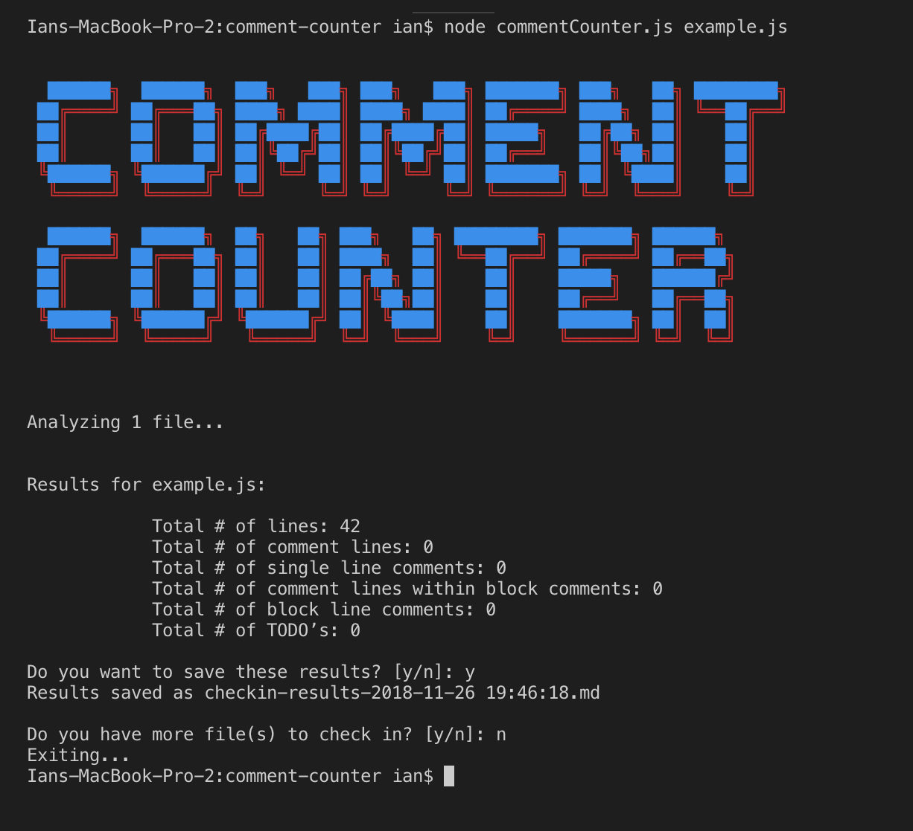

# comment-counter
Command-line tool that analyzes comments in JS files.

## Tech Stack
- Node.js
- JavaScript
- Mocha & Chai

###### Requirements:
- Node (Version >=8 Recommended)
- NPM

## Usage

###### Installing
```
npm install
```

###### Run
 ```
 node commentCounter.js <filename(s)>
 
 # EXAMPLE
 
 node commentCounter.js mywork.js codefile.js

 ```

 ###### Run the Test Suite
 ```
 npm test
 ```

### Known Limitations
- Files that you want to scan *must* be moved into the project folder (where commentCounter.js is located)
- Only recognizes JavaScript files

## Functional Requirements
- When a file is checked in, scan the file to count the total number of lines.
- Scan the file to identify comments and count the total lines of comments in the file.
- After identifying the lines of comments, scan to segregate the total number of single line comments and the total number of multi-line comments.
- Any line of code that has a trailing comment should be counted both as lines of code and also a comment line.
- Identify and count the total number of TODOs.
- Files checked in without an extension can be ignored.
- Ignore file names that start with a ‘.’

## Screenshot

